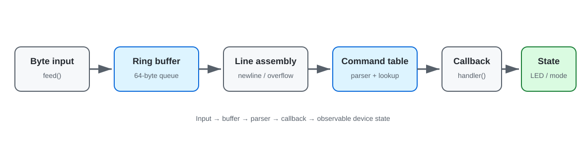
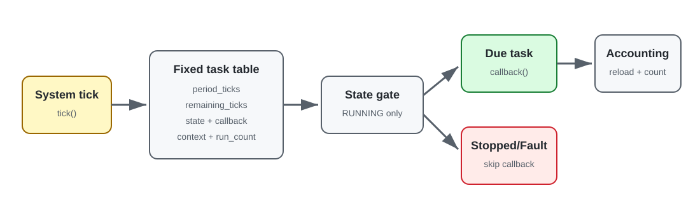

# Embedded-C-Cpp-Learning

嵌入式 C/C++ 程序设计与工程实践记录。仓库从数据表示、指针和内存开始，继续覆盖多文件接口、回调、对象封装与状态机，并用命令处理框架和轻量任务管理器把这些能力组合成可独立构建的软件项目。

精选课程源码保存在 `course/`，个人实现保存在 `practice/`。主机端测试负责验证接口、边界和状态转换；硬件外设实践另见 [STC89C52RC 学习仓库](https://github.com/REliasCheng/stc89c52-learning)。

## 技术能力地图

`C 数据表示与缓冲区 → 指针和资源管理 → 模块接口与回调 → C++ 对象与容器 → 嵌入式软件结构`

| 能力方向 | 仓库中的具体内容 | 入口 |
| --- | --- | --- |
| C 语言基础 | 定宽整数、位运算、分支、数组长度和字符串存储 | [C 语言基础能力](projects/01_C语言基础能力/README.md) |
| C 语言核心 | 地址传递、堆内存、结构体/枚举、受检的文件 I/O | [C 语言核心能力](projects/02_C语言核心能力/README.md) |
| 程序设计 | 头源分离、模块内部状态、函数指针回调 | [程序设计能力](projects/03_程序设计能力/README.md) |
| C++ 程序设计 | 类/构造、私有状态、引用、`vector` | [C++ 程序设计](projects/04_C++程序设计/README.md) |
| 嵌入式软件思想 | 分层与接口边界分析、主机端事件状态机 | [嵌入式软件思想](projects/05_嵌入式软件思想/README.md) |
| 综合软件实践 | 环形缓冲区、命令回调、任务表、周期 tick 与故障状态 | [综合软件实践](projects/06_综合软件实践/README.md) |

## 软件架构

两个综合项目把前面的语言知识组织成可测试的软件边界。命令处理框架将输入字节、缓存、解析和设备状态分离；任务管理器使用固定容量任务表、周期 tick 和状态门控组织回调执行。

| 嵌入式命令处理框架 | 轻量任务状态管理 |
| --- | --- |
|  |  |

架构图直接对应 `projects/06_综合软件实践/` 中的源码和断言测试，当前验证范围为 Windows GCC 主机环境。

## 代表性实践

这些 `practice/` 文件是本仓库中与课程原版分开的个人实现；测试结论仅针对下列主机端场景。

| 实践 | 工程关注点 | 已做验证 |
| --- | --- | --- |
| [显式长度的数组求和](projects/01_C语言基础能力/数组与字符串/practice/array_sum.c) | 指针与长度成对传递；拒绝无效参数与求和溢出 | 正常、空数组、无效参数 |
| [受检的堆缓冲区](projects/02_C语言核心能力/动态内存管理/practice/int_buffer.c) | 尺寸计算、申请失败、释放后置空 | 正常、零长度、过大长度 |
| [结构体文件读写](projects/02_C语言核心能力/文件IO/practice/checked_records.c) | 打开/传输/关闭检查 | 两条记录读回；无效路径返回错误 |
| [多文件 counter](projects/03_程序设计能力/多文件工程设计/practice/counter.h) | 头文件只暴露接口，状态留在实现文件 | 加减和溢出拒绝 |
| [受控的 Student 类](projects/04_C++程序设计/封装设计/practice/student.hpp) | 私有字段、构造校验、受检更新 | 有效对象与无效状态 |
| [事件状态机](projects/05_嵌入式软件思想/状态机思想/practice/key_fsm.h) | 状态与输入事件分离 | 主机端短按、长按序列 |
| [嵌入式命令处理框架](projects/06_综合软件实践/嵌入式命令处理框架/README.md) | 环形缓冲、逐字节组帧、命令表与回调分发 | 正常命令、参数错误、未知命令、溢出恢复 |
| [轻量任务状态管理](projects/06_综合软件实践/轻量任务状态管理/README.md) | 固定任务表、周期 tick、运行/停止/故障转换 | 双周期任务、故障隔离、复位重启 |

## 软件结构与来源

```text
projects/
  01_C语言基础能力/
  02_C语言核心能力/
  03_程序设计能力/
  04_C++程序设计/
  05_嵌入式软件思想/
  06_综合软件实践/
docs/                 构建、结构、调试和技术关联
assets/               真实图片/视频的预留位置
```

每个技术主题按实际内容使用 `course/`（课程原版）、`practice/`（个人代码）和 `docs/`（分析与来源）。V1 的三个专题已归入对应技术主题，源码和原有分析均保留；课程编号用于[来源追溯](docs/学习与工程路线.md)，首页按技术能力导航。

源码归属与公开使用边界见 [THIRD_PARTY_NOTICES.md](THIRD_PARTY_NOTICES.md)。根目录 [LICENSE](LICENSE) 仅覆盖本人有权授权的原创代码和文档。

## 构建与验证

本机环境为 Windows PowerShell、GCC/G++ 16.1.0。个人代码按 C11/C++11 分别构建，启用 `-Wall -Wextra -Werror -pedantic`；课程 C++ 原文件是 GBK 编码，编译时指定 `-finput-charset=GBK`。各示例拥有独立 `main`，按项目分别构建。

命令与编码说明见[编译环境说明](docs/编译环境说明.md)，验证方法及真实警告见[调试方法](docs/调试方法.md)。当前验证结果来自主机端 GCC/G++ 构建与断言测试。

## 工程文档

- [工程结构设计](docs/工程结构设计.md)：目录约定、专题归并和调用边界。
- [代码规范](docs/代码规范.md)：如何保留课程原版并维护个人代码。
- [C 语言与嵌入式开发关联](docs/C语言与嵌入式开发关联.md)：哪些语言机制可迁移到驱动设计，哪些仍待硬件验证。
- [学习与工程路线](docs/学习与工程路线.md)：技术阶段和课程原始路径的对应。

## 展示与下一步

目前展示证据包括源码、架构图、差异分析和主机端验证记录。[assets](assets/README.md) 说明展示资源与后续实机素材的管理方式。

## 技术路线中的位置

[Embedded-Systems-Foundations](https://github.com/REliasCheng/Embedded-Systems-Foundations) → **Embedded-C-Cpp-Learning** → [stc89c52-learning](https://github.com/REliasCheng/stc89c52-learning) → [BlueBridgeCup-MCU](https://github.com/REliasCheng/BlueBridgeCup-MCU)

下一步把已经验证的缓冲区、命令分发和状态管理接口带到真实 MCU 通信与任务调度中，再继续进入 STM32、FreeRTOS 和 Embedded Linux。
