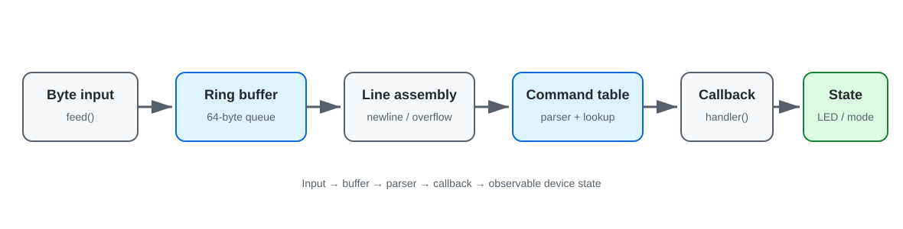
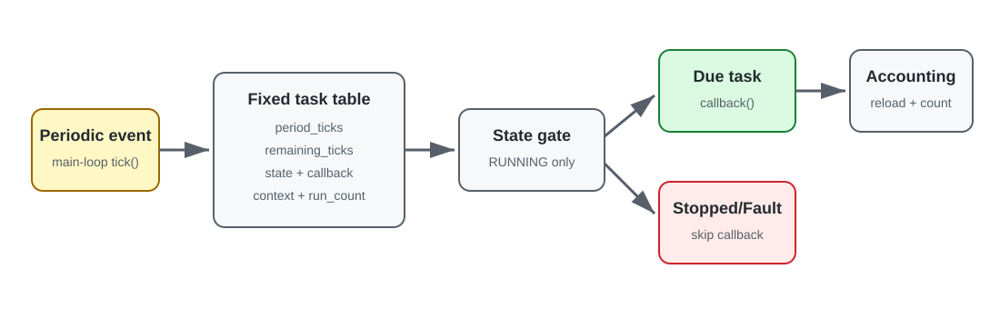

# Embedded-C-Cpp-Learning

面向嵌入式软件开发的 C/C++ 基础与工程化实践仓库。内容从安全的数据处理接口出发，逐步覆盖多文件组织、C++ 封装、状态机、命令解析、环形缓冲区、轻量任务调度与可测试的软件边界。

## 技术栈与运行平台

- **语言**：C11、C++11
- **工具链**：GCC / G++，`-Wall -Wextra -Werror -pedantic`
- **测试方式**：主机端可执行程序与 `assert` 测试
- **目标环境**：Windows 或 Linux 主机；核心逻辑不依赖特定 MCU

## Quick Start

以下命令在 Windows PowerShell 中从仓库根目录执行，只验证可移植的主机端软件逻辑。完整环境说明见[编译环境说明](docs/编译环境说明.md)。

```powershell
New-Item -ItemType Directory -Path .build -Force | Out-Null

# Command Framework
gcc -std=c11 -Wall -Wextra -Werror -pedantic `
  projects/06_综合软件实践/嵌入式命令处理框架/practice/src/ring_buffer.c `
  projects/06_综合软件实践/嵌入式命令处理框架/practice/src/device.c `
  projects/06_综合软件实践/嵌入式命令处理框架/practice/src/command.c `
  projects/06_综合软件实践/嵌入式命令处理框架/tests/test_command_framework.c `
  -I projects/06_综合软件实践/嵌入式命令处理框架/practice/include `
  -o .build/command-framework-test.exe
./.build/command-framework-test.exe

# Task Manager
gcc -std=c11 -Wall -Wextra -Werror -pedantic `
  projects/06_综合软件实践/轻量任务状态管理/practice/src/task_manager.c `
  projects/06_综合软件实践/轻量任务状态管理/tests/test_task_manager.c `
  -I projects/06_综合软件实践/轻量任务状态管理/practice/include `
  -o .build/task-manager-test.exe
./.build/task-manager-test.exe
```

这些命令不代表 MCU 交叉编译、Keil 构建或开发板运行验证。

## Featured Examples

| 示例 | 源码入口 | 测试入口 | 展示重点 |
| --- | --- | --- | --- |
| Command Framework | [`command.c`](projects/06_综合软件实践/嵌入式命令处理框架/practice/src/command.c) | [`test_command_framework.c`](projects/06_综合软件实践/嵌入式命令处理框架/tests/test_command_framework.c) | 固定容量输入、命令解析、错误边界与设备状态更新 |
| Task Manager | [`task_manager.c`](projects/06_综合软件实践/轻量任务状态管理/practice/src/task_manager.c) | [`test_task_manager.c`](projects/06_综合软件实践/轻量任务状态管理/tests/test_task_manager.c) | 周期任务、运行状态、故障与复位流程 |
| Firmware Console | [`firmware_console.c`](projects/06_综合软件实践/固件控制台集成/practice/src/firmware_console.c) | [`test_firmware_console.c`](projects/06_综合软件实践/固件控制台集成/tests/test_firmware_console.c) | 命令框架与任务管理的组合、回调边界与集成测试 |

## 架构说明

### 命令处理框架



字节流先进入固定容量环形缓冲区，再由命令引擎在主循环语境中完成解析和设备状态更新。中断或输入层只负责提交数据，避免把完整命令处理放进时间敏感路径。

### 轻量任务状态管理



任务表保存周期、运行状态、回调与上下文；`tick` 只推进确定性的状态。固件控制台示例把命令框架与任务管理组合起来，展示模块复用和集成测试。

## 核心内容

| 方向 | 代表实现 | 工程关注点 |
| --- | --- | --- |
| C 基础 | 数组求和、字符串与定宽数据 | 长度传递、溢出与输入边界 |
| 资源管理 | 动态缓冲区、受检文件读写 | 生命周期、错误返回、释放路径 |
| 模块化 | 多文件计数器 | 声明/实现分离、内部状态封装 |
| C++ 封装 | `Student` 类实践 | 构造约束、成员状态与接口设计 |
| 状态机 | 按键事件模型 | 输入事件与状态转换解耦 |
| 嵌入式软件结构 | 命令框架、任务管理、固件控制台 | 固定容量、回调、组合与可测试性 |

## 工程结构

```text
projects/
  01_C语言基础能力/          数组与字符串
  02_C语言核心能力/          内存与文件 I/O
  03_程序设计能力/           多文件模块
  04_C++程序设计/            类与封装
  05_嵌入式软件思想/         状态机
  06_综合软件实践/           命令、任务与固件控制台
docs/                       工程方法、构建与调试记录
assets/images/architecture/ 自绘架构图
```

### 目录导航

| 想查看的内容 | 入口 |
| --- | --- |
| C/C++ 基础与模块化源码 | [`projects/01_C语言基础能力`](projects/01_C语言基础能力) → [`projects/04_C++程序设计`](projects/04_C++程序设计) |
| 嵌入式软件结构源码 | [`projects/05_嵌入式软件思想`](projects/05_嵌入式软件思想) 与 [`projects/06_综合软件实践`](projects/06_综合软件实践) |
| 主机端测试 | [`Command Framework tests`](projects/06_综合软件实践/嵌入式命令处理框架/tests) · [`Task Manager tests`](projects/06_综合软件实践/轻量任务状态管理/tests) · [`Firmware Console tests`](projects/06_综合软件实践/固件控制台集成/tests) |
| 构建、设计与调试文档 | [`docs`](docs) |

## 文档导航

- [学习与工程路线](docs/学习与工程路线.md)
- [C 语言与嵌入式开发关联](docs/C语言与嵌入式开发关联.md)
- [工程结构设计](docs/工程结构设计.md)
- [编译环境说明](docs/编译环境说明.md)
- [调试方法](docs/调试方法.md)

## 验证范围

当前保留的主机端模块已使用 GCC/G++ 16.1.0 验证。命令框架、任务管理和固件控制台集成测试均通过，且使用严格警告选项构建。

这里验证的是可移植软件逻辑，不等同于 MCU 交叉编译、Keil 构建或硬件运行验证；仓库也不把主机测试描述为板端结果。

## License Boundary

根目录 [MIT License](LICENSE) 适用于仓库维护者编写的代码、文档与 SVG 图示。外部工具链、芯片资料、课程材料及未随仓库分发的第三方实现不因被提及而纳入该许可。
